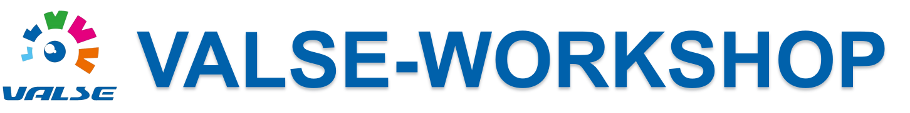

---

  

[简体中文](./README.md)|English

# Abstract

The main purpose of the VALSE annual seminar is to provide a stage for deep academic exchanges among young Chinese scholars (mainly born in the post-80 s) in the fields of computer vision, image processing, pattern recognition and machine learning. On this stage, we uphold and advocate the scientific spirit of rational criticism, brave exploration, demonstration, and innovation. On this stage, we advocate the rational and pure academic contention and ideological confrontation of freedom and equality; On this stage, we expect to appreciate the increasingly beautiful academic waltz (VALSE) of young domestic scholars. Through this stage, we hope to promote the exchange of ideas and academic cooperation among young domestic scholars, so as to make heavyweight academic contributions in relevant fields, and enhance the academic influence of Chinese scholars on the international academic stage. so far, VALSE has been successfully held for twelve sessions,  VALSE 2011 (Hangzhou), VALSE 2012 (Xi'an), VALSE 2013 (Nanjing), VALSE 2014 (Qingdao), VALSE 2015 (Chengdu), VALSE 2016 (Wuhan), VALSE 2017 (Xiamen), VALSE 2018 (Dalian), VALSE 2019 (Hefei), VALSE 2020 (online), VALSE 2021 (Hangzhou), VALSE 2022 (Tianjin).

| No.  |    Year    |   Pos.   |                             Url                              |
| :--: | :--------: | :------: | :----------------------------------------------------------: |
|  1   | VALSE 2011 | Hangzhou | [website](http://www.cs.zju.edu.cn/~gpan/valse2011/main.psp) |
|  2   | VALSE 2012 |  Xi'an   |              [website](http://valser.org/2012/)              |
|  3   | VALSE 2013 | Nanjing  |              [website](http://valser.org/2013)               |
|  4   | VALSE 2014 | Qingdao  |              [website](http://valser.org/2014)               |
|  5   | VALSE 2015 | Chengdu  |              [website](http://valser.org/2015)               |
|  6   | VALSE 2016 |  Wuhan   |              [website](http://valser.org/2016)               |
|  7   | VALSE 2017 |  Xiamen  |              [website](http://valser.org/2017)               |
|  8   | VALSE 2018 |  Dalian  |    [website](http://ice.dlut.edu.cn/valse2018/index.html)    |
|  9   | VALSE 2019 |  Hefei   |             [website](http://valser.org/2019/#/)             |
|  10  | VALSE 2020 |  online  |             [website](http://valser.org/2020/#/)             |
|  11  | VALSE 2021 | Hangzhou |             [website](http://valser.org/2021/#/)             |
|  12  | VALSE 2022 | Tianjin  |             [website](http://valser.org/2022/#/)             |
|  13  |    ...     |   ...    |                             ...                              |
|  14  |     -      |    -     |                              -                               |

---

# Introduction

